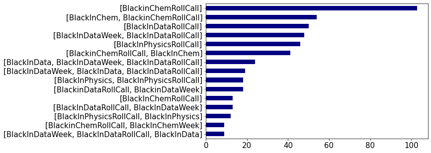

In STEM (Science, Technology, Engineering, and Mathematics) fields, the number of Black people is usually small. This is usually especially true for Black people at predominantly white institutions (PWIs) where there is usually a single digit number of Black people. This was true for me as I rarely interacted with other Black people in Physics except at conferences like the National Society of Black Physicists (NSBP) or the Society for Advancement of Chicanos/Hispanics and Native Americans in Science (SACNAS). Having a network and people who understand what you're going through is important for successs in a field.

**Goal: To help increase the network or community of a Black person in STEM.**

I developed a recommendation system that will recommend people in STEM to follow based on specific given keywords. For now these include the **Black in Physics**, **Black in Chemistry**, and **Black in Data** weeks. These will be referenced as Black in X where X is physics, chemistry, or data.

## Running the Notebook

To run the notebook, the git repository can be dowloaded using:

```
git clone https://github.com/lenona/Black-in-X-Data-Project.git
```

From the directory that was downloaded the notebook can be started from the command line using:

```
jupyter notebook
```

## How to get the data

The data used in this project can be downloaded from the repository using the `git clone` command listed above. The data is located in the `Data` folder. 

New data can also be scraped from Twitter using `snscrape`. To install `snscrape` use the command `pip install snscrape`.

After `snscrape` is installed you can use the following commands to download the data:

```bash
os.system("snscrape --jsonl --max-results 500 --since 2020-10-25 twitter-search '#BlackInPhysicsRollCall until:2020-10-31' > Black_in_Physics.json")

os.system("snscrape --jsonl --max-results 500 --since 2020-11-16 twitter-search '#BlackInDataRollCall until:2020-11-21' > Black_in_Data.json")

os.system("snscrape --jsonl --max-results 500 --since 2020-08-09 twitter-search '#BlackInChemRollCall until:2020-08-15' > Black_in_Chem.json")
```

## Walkthrough

### 1. Import python libraries and dataset, exploratory data analysis (EDA) 
We import the necessary python libraries and dataset generated using `snscrape`.

```python
import os
import pandas as pd
pd.options.mode.chained_assignment = None
import numpy as np
import matplotlib.pyplot as plt
from rake_nltk import Rake
```

We add a research category to the datasets that were imported to be included in our search words later. 

```python
BiP_df['research'] = 'Physics'
BiC_df['research'] = 'Chemistry'
BiD_df['research'] = 'Data'
```
When exploring the dataset there are 962 tweets (rows) and 29 attributes (columns). Of the available attributes the most useful are **user**, **content** (tweets), **hashtags**, and **research**. We show the 15 most popular hashtags.

```python
Blackin_df['hashtags'].value_counts()[0:15].plot(kind='barh', figsize=[8,5], fontsize=15, color='navy').invert_yaxis()
```



### 2. Data Pre-processing
First, We want to remove all of the tweets that don't contain introduction words. The tweets that don't contain words from the list of introduction words will most likely not be introduction tweets in the #BlackinXRollCall. The tweets that don't contain introductions are then dropped from the dataset.

We then pre-process the data using NLP to combine all of the attributes for each person into one column. After this we can use Jaccard Similarity to calculate the similarity between our list of keywords and the search_words for each person.

We remove the tweets that don't contain introduction words and drop them from our data. We want to remove the tweets that don't contain introductions as are likely be supporting or encouraging tweets. This leaves us with 452 tweets (rows) from of the original 962. 

```python
introduction = ["Hey", "Hello", "Hi", "I am", " I\'m ", "name", "check in", "research"]
i = 0
drop_idx = []
for idx in range(len(content)):
    if any(word in content[idx] for word in introduction):
        continue
    else:
        drop_idx.append(idx)

df = Blackin_df.drop(drop_idx, axis=0).reset_index(drop=True)
```

We want to create a list of keywords from the column labeled *content* in the dataframe. The *content* column contains the tweets from #BlackinXRollCall. We also want to use the descriptions and research columns when we build our recommender system. We extract the tweets; user names, display names, and descriptions; and research from the data. We use the Rapid Automatic Keyword Extraction (RAKE) library to remove all of the stop words, punctuation, whitespace, and convert all of the letters to lowercase.

```python
df['Key_words'] = ''
df['Name'] = ''
df['Description'] = ''
df['username'] = ''

r = Rake()
#save keywords from tweets
for index,row in df.iterrows():
    r.extract_keywords_from_text(row['content'])
    key_words_dict_scores = r.get_ranked_phrases()
    row['Key_words'] = list(key_words_dict_scores)
    df['Key_words'][index] = row['Key_words']
    
    r.extract_keywords_from_text(row['user']['description'])
    key_words_dict_scores = r.get_ranked_phrases()
    row['Description'] = list(key_words_dict_scores)
    df['Description'][index] = row['Description']
    
    r.extract_keywords_from_text(row['research'])
    key_words_dict_scores = r.get_ranked_phrases()
    row['research'] = list(key_words_dict_scores)
    df['research'][index] = row['research']
    
    r.extract_keywords_from_text(row['user']['displayname'])
    key_words_dict_scores = r.get_ranked_phrases()
    row['Name'] = list(key_words_dict_scores)
    df['Name'][index] = row['Name']
    
    r.extract_keywords_from_text(row['user']['username'])
    key_words_dict_scores = r.get_ranked_phrases()
    row['username'] = list(key_words_dict_scores)
    df['username'][index] = row['username']
```

### 3. Create a column containing search words for each person
We create new column that contains the search words for each person based on the tweets, descriptions, hashtags, and research topics. Create a new dataframe that just contains the descripters for each person (i.e. name, username) and keywords.

```python
df['search_words'] = ''
columns = ['research', 'Key_words', 'Description', 'hashtags']
for index, row in df.iterrows():
    words = ''
    for col in columns:
        words += ' '.join(row[col]) + ' '
    row['search_words'] = words
    df['search_words'][index] = row['search_words']
new_df = df[['Name', 'username', 'search_words']]
new_df['name_user'] = new_df['Name'] + new_df['username'] 
```

### 4. Calculate the Jaccard Similarity
The Jaccard similarity is a statistic used to gauge the similarity of data sets.

This is measured as the similarity of two finite data sets (A,B) and is defined by the size of the intersection ($| A \cup B|$). The equation for Jaccard similarity is given by

$$ \begin{equation} J(A,B) = \frac{|A\cap B|}{|A| + |B| + |A\cap B|}. \end{equation}$$

These numbers are calculated between $0 \leq J(A,B) \leq 1$.

```python
def get_jaccard_sim(str1, str2):
    a = set(str1) #Create an unordered, unindexed list that does not contain duplicate values from the string
    b = set(str2) 
    c = b.intersection(a) #Calculates the intersection of the two strings
    return(float(len(c)) / (len(a) + len(b) - len(c)))
```

### 5. Create and test the recommender
We create a recommender that takes the list of given keywords as input and calculates the Jaccard similarity between that list and the search word list for every person. The top *n* hits are returned in **Name**, **username**, order based on the highest calculated similarity.

Regardless of the number of hits that you can give the recommender, it will only return a hit if the calculated Jaccard similarity is greater than 0. If the calculated Jaccard similarity is 0 it will drop the index and only return the hits that are greater than 0. 

```python
def recommender(keywords, number_of_hits=2, keyword_number=3):
    '''
    keywords: sets the keywords used to search for similar people
    number_of_hits: sets the number of people that the code will return. default = 2
    keyword_number: minimum number of keywords to match for each person. default = 3
    prints Name, twitter username, Jaccard similarity score
    '''

    keywords = keywords.replace(' ','').split(',')
    jaccards = []
    for search in new_df['search_words']:
        matches = {x for x in keywords if x in search}
        if len(matches) >= keyword_number: 
            jaccards.append(get_jaccard_sim(keywords,list(search.split(' '))))
        else:
            jaccards.append(0.0)
    
    jaccards = pd.Series(jaccards)
    j_index = jaccards.nlargest(number_of_hits+1).index
    high_matches = new_df.loc[j_index]
    drop_idx = []
    for i in j_index:
        if jaccards[i] == np.float64(0.00):
            drop_idx.append(i)
    j_index = j_index.drop(drop_idx)
    
    high_matches = new_df.loc[j_index]

    for match,score in zip(zip(high_matches['Name'],high_matches['username']),jaccards[j_index]):
        print(match, score)
```

We test the recommender for each of the research categories (physics, chemistry, and data)

#### Chemistry
```python
recommender('chemistry, nanoparticles, phd, candidate, nanotech, biological, applications', 5,4)
```

This will return the top 5 matches using a minimum number of 4 keywords to match. The results are below:
```
(['olivia'], ['oliviageneus']) 0.12244897959183673
(['chey jones'], ['cheymjones']) 0.11904761904761904
(['sun kly'], ['sun_kly']) 0.1
(['neuro saweetie ❄️🧠', 'gwenaëlle'], ['getneuro']) 0.1
(['nathalie momplaisir'], ['steministnat']) 0.0975609756097561
```
The best match is `Name: Olivia`, `Twitter Username: oliviageneus`. The corresponding tweet is: 

> Get in, losers! We’re making nanoparticles 🗣🤪 Hi 👋🏾#BlackInChem #BlackinChemRollCall Olivia here! 4th yr PhD Candidate in Physical Chemistry using nanotechnology for biological applications. I have a B.S in Physics, &amp; Public Health. Excited to meet everyone!

> IG: muhammad.oli https://t.co/HILgZl4WHo

#### Data
```python
recommender('data, phd, hemoshear, engineering, rare, disease', 5)
```

This will return the top 5 matches using the default number of keywords (default = 3).
```
(['kris rawls', 'phd'], ['kdrawls']) 0.125
(['dare imam', 'lawal'], ['drdreibile']) 0.09375
(['byron tweets data'], ['byrontweetsdata']) 0.07894736842105263
(['dissertating informaticist', 'kimberly'], ['datakimist']) 0.020833333333333332
```
As you can see there were not 5 hits returned. This is beccause only 4 people were good matches and the 5th match had a Jaccard similarity score of 0 so it was removed from the results. 
The best match is `Name: Kris Rawls, PhD`, `Twitter Username: kdrawls`. The corresponding tweet is: 

>  It’s #BlackInDataWeek ! Hi I’m Kris. I have a PhD in Biomedical Engineering and I am a Data Scientist @HemoShear . I use data to understand rare diseases and the effects of different treatments. @BlkInData #BlackInDataRollCall #BlackInData https://t.co/802ptN76X6

#### Physics
```python
recommender('physics, eccentric, gravitational, waves, soccer, candidate, eccentricity', 3,5)
```

This will return the top 3 matches using the a minumum number of 5 matching keywords.
```
(['cheeseboro 🇹🇹🖤🤍💜 🏳️\u200d🌈', 'belinda'], ['bdcheeseboro']) 0.13157894736842105
(['amber lenon', 'dr'], ['amberkiana_']) 0.125
```

Similarly to the data section only 2 hits were returned. This is because only 2 people were good matches and the other matches had a score of 0, so they were removed from the results. 
The best match is `Name: belinda cheeseboro`, `Twitter Username: bdcheeseboro`. The corresponding tweet is: 

>  Hey y'all!! I'm currently a 6th year PhD candidate in Physics and Astronomy @WestVirginiaU and my research is in eccentric gravitational waves 😁 #BlackInPhysics #BlackinAstro https://t.co/0wfedR1WJV

### Conclusion

The model has recommended good matches based on the corresponding tweet of the top hit. From my knowledge about the BlackinPhysics, BlackinChemistry and BlackinData weeks these are very good matches for the corresponding keywords. The more keywords that you give the recommender and the higher you make the minimum number of matched keywords the most accurate the recommender will be. 

